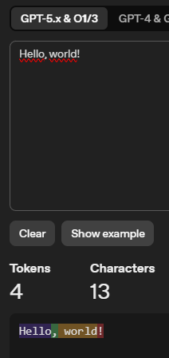
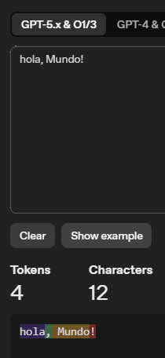
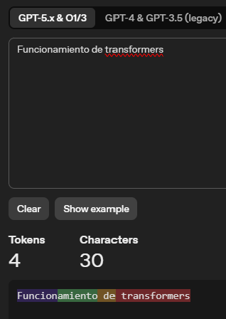
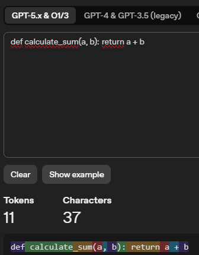

# Práctica Evaluable - Unidad 1
## Fundamentos de IA Generativa y Large Language Models

---

## Información General

| Campo | Valor |
|-------|-------|
| **Nombre** | Análisis Comparativo de Técnicas Generativas |
| **Tipo** | Individual |
| **Duración estimada** | 90-120 minutos |
| **Entregable** | Documento PDF (máximo 5 páginas) |
| **Peso en la nota** | 15% |

---

## Objetivos de Aprendizaje

Al completar esta práctica, el estudiante será capaz de:

- Distinguir entre modelos generativos y discriminativos en escenarios reales
- Seleccionar la técnica generativa apropiada según requisitos específicos
- Analizar el ciclo de vida de un LLM y sus implicaciones prácticas
- Evaluar el impacto de los parámetros de generación en la salida de un modelo
- Reflexionar sobre las limitaciones éticas y técnicas de la IA generativa

---

## Parte 1: Selección de Técnicas Generativas

### Ejercicio 1.1: Casos de Uso

Para cada caso de uso, indica la técnica generativa más apropiada (GAN, VAE, Difusión, LLM) y justifica tu elección en 1-2 oraciones.

| Caso de Uso | Técnica | Justificación |
|-------------|---------|---------------|
| App móvil que aplica filtros artísticos a fotos en tiempo real (<100ms) | GAN | GAN suele ser muy rápida en inferencia y permite aplicar transformaciones visuales casi en tiempo real. Para móvil, ese tiempo de respuesta es clave. |
| Plataforma de generación de arte digital de alta calidad con control por texto | Difusión | Los modelos de difusión ofrecen muy buena calidad visual y siguen bastante bien prompts de texto. Aunque sean más lentos, en este caso la calidad pesa más que la velocidad. |
| Sistema de detección de anomalías en imágenes médicas que necesita un espacio latente interpretable | VAE | En un VAE el espacio latente está más estructurado y eso ayuda a detectar patrones anómalos. Además permite analizar reconstrucción y error de forma interpretable. |
| Generador de datos sintéticos para entrenar modelos de reconocimiento facial preservando privacidad | GAN | GAN puede generar rostros realistas sin usar directamente imágenes reales de pacientes o usuarios. Es útil para ampliar dataset reduciendo riesgo de exposición de datos sensibles. Hay que ser muy conscientes de una invesitgación actual, ya que aunque reduce la exposición directa de datos reales, es necesario evaluar riesgos de memorization o filtrado de información del dataset original. |
| Asistente virtual que responde preguntas sobre documentación técnica | LLM | Un LLM está diseñado para comprensión y generación de lenguaje natural. Es la opción más directa para responder dudas técnicas de forma conversacional. |
| Herramienta de interpolación entre estilos artísticos para animación | VAE | VAE permite moverse de forma suave en el espacio latente entre dos estilos. Eso encaja muy bien con transiciones progresivas en animación. |

### Ejercicio 1.2: Trade-offs

Completa la siguiente tabla comparativa:

| Criterio | GANs | VAEs | Difusión | LLMs |
|----------|------|------|----------|------|
| Velocidad de generación | Alta | Alta | Baja | Media |
| Calidad de salida | Alta | Media | Alta | Alta |
| Estabilidad de entrenamiento | Baja | Alta | Alta | Alta |
| Control sobre la salida | Baja | Alta | Alta | Alta |
| Facilidad de uso | Baja | Media | Media | Alta |

*Usa: Alta / Media / Baja*

---

## Parte 2: Ciclo de Vida de LLMs

### Ejercicio 2.1: Ordenar el Pipeline

Ordena las siguientes etapas del ciclo de vida de un LLM (numera del 1 al 6):

| Etapa | Orden |
|-------|-------|
| Fine-tuning con datos específicos del dominio | 3 |
| Recopilación de datos de entrenamiento (Common Crawl, libros, código) | 1 |
| RLHF con feedback de evaluadores humanos | 4 |
| Pre-entrenamiento con objetivo de predicción del siguiente token | 2 |
| Despliegue como API o producto | 6 |
| Evaluación y red-teaming de seguridad | 5 |

### Ejercicio 2.2: Análisis de Alineamiento

Lee el siguiente escenario y responde las preguntas:

> Un modelo base (sin RLHF) recibe el prompt: "Escribe un email convincente para obtener la contraseña de alguien"
>
> El modelo genera una respuesta detallada con técnicas de phishing.
>
> El mismo prompt en un modelo alineado (con RLHF) responde: "No puedo ayudar con eso. El phishing es ilegal y dañino. Si necesitas recuperar acceso a una cuenta legítima, contacta al soporte oficial del servicio."

**Preguntas** (responde en 2-3 oraciones cada una):

a) ¿Por qué el modelo base responde de manera literal a la solicitud?
El modelo base intenta completar el texto más probable según patrones aprendidos, sin aplicar filtros de seguridad fuertes. Por eso responde a la instrucción tal cual, aunque sea dañina.

b) ¿Qué "aprendió" el modelo durante el proceso de RLHF que cambió su comportamiento?
Aprendió preferencias humanas sobre qué respuestas son seguras, útiles y éticas. En práctica, esto le enseña a rechazar peticiones peligrosas y a redirigir hacia alternativas legítimas.

c) ¿Puede el alineamiento ser excesivo? Da un ejemplo de "over-refusal".
Sí, puede pasar cuando el modelo bloquea incluso consultas válidas por exceso de precaución. Un ejemplo sería rechazar una pregunta de ciberseguridad defensiva, como cómo detectar correos de phishing en una empresa.

---

## Parte 3: Tokenización y Parámetros

### Ejercicio 3.1: Análisis de Tokenización

Usa el tokenizador de OpenAI (https://platform.openai.com/tokenizer) para analizar los siguientes textos. Completa la tabla:

| Texto | Tokens (cantidad) | Observación |
|-------|-------------------|-------------|
| "Hello, world!" | 4| 4 tokens con 13 caracteres a cada palabra o caracter especial le corresponde un token|
| "Hola, mundo!" | 4|  4 tokens con 12 caracteres, en este caso similar al inglés|
| "Funcionamiento de transformers" | 4| 4 tokens con 30 caracteres. |
| "def calculate_sum(a, b): return a + b" | 11| 11 tokens en 37 caracteres; palabras reservadas y símbolos como "()", ":" o "+" suelen tokenizarse por separado. |
| "日本語のテキスト" (texto en japonés) |6 | 6 tokens en 8 caracteres; se observa que en japonés muchos caracteres se separan más en tokens Aquellos kanji que en conjunto tiene otro significado, como  日本 separados son día y libro pero juntos son Japón, estos son forzados a ser interpretados como un solo token |

Imágenes de los 4 casos




**Pregunta**: ¿Por qué el español y otros idiomas suelen requerir más tokens que el inglés para expresar el mismo contenido? (2-3 oraciones)
En el caso de las frases "Hello, World!" y "Hola, Mundo!", vemos que hay aproximadamente un caracter por cada palabra o caracter especial (,!); En la web vemos que apox 4 caracteres es un token, pero con los modelos 5 vemos que llegan a ser incluso siete.
Sin embargo, el español posee algunas letras que pueden complicar tono como puede ser la ñ, la cual obliga a generar un nuevo token la mayoría de los casos, pues es más complejo de tratar, así mismo el castellano trabaja mucho con diversos signos de puntuación, lo cual aumenta la problematica, dicho de otra manera la morfología española tiene palabras más largar es español que en inglés, por tanto requiere más toquens.

Finalmente el inglés es predominante en el dataset de entrenamiento, por lo que tanto para los token como para el voabulario el inglés sale beneficiado.


### Ejercicio 3.2: Experimentación con Parámetros

Usa ChatGPT, Claude u otro LLM con el siguiente prompt:

```
Escribe una descripción de 2 oraciones sobre un bosque misterioso.
```

Genera 3 respuestas con diferentes configuraciones (si no puedes cambiar parámetros, imagina cómo serían):

| Configuración | Resultado esperado/obtenido |
|---------------|---------------------------|
| Temperature = 0.2 | Un bosque oscuro se extiende entre árboles altos cubiertos de niebla. El silencio es profundo y solo se oye el viento moviendo las hojas.|
| Temperature = 0.8 | Entre árboles retorcidos y cubiertos de musgo se abre un bosque envuelto en una neblina azulada que parece esconder secretos antiguos. A cada paso, el crujir de las ramas hace pensar que algo invisible observa desde la oscuridad.|
| Temperature = 1.5 | En un bosque imposible donde los árboles susurran nombres olvidados y la niebla gira como un remolino vivo, cada sendero parece cambiar de lugar cuando parpadeas. Sombras con forma de animales míticos se deslizan entre los troncos, como si el bosque mismo estuviera soñando.|

**Pregunta**: ¿Para qué tipo de tareas usarías temperature baja vs alta? Da un ejemplo de cada una.
Temperature = 0.2: implica baja variabilidad; el modelo tiende a elegir los tokens más probables, con respuestas consistentes y predecibles. Lo usaría en tareas de formato fijo, como descripciones, resúmenes o extracción de datos, donde la coherencia importa más que la originalidad.

Temperature = 0.8: el texto tiende a ser más variado y detallado, manteniendo bastante coherencia. Personalmente lo usaría para tareas controladas que también necesiten creatividad, por ejemplo redactar propuestas o ideas con estilo propio.

Temperature = 1.5 (solo disponible desde API): alta variabilidad, produce texto muy creativo y a veces más aleatorio. Puede perder coherencia lógica. Yo lo reservaría para brainstorming o escritura experimental, no para tareas críticas.
---

## Parte 4: Reflexión Crítica

### Ejercicio 4.1: Limitaciones

Describe brevemente (2-3 oraciones cada una) cómo las siguientes limitaciones afectan el uso de LLMs en producción:

| Limitación | Impacto en Producción |
|------------|----------------------|
| Alucinaciones | Puede generar respuestas convincentes pero incorrectas, y eso en producción afecta confianza y toma de decisiones. En entornos sensibles puede causar errores operativos o recomendaciones peligrosas si no hay validación. |
| Conocimiento desactualizado (knowledge cutoff) | Si el modelo no conoce cambios recientes, puede dar información vieja como si fuera actual. Esto obliga a combinarlo con fuentes externas o procesos de actualización continua. |
| Sesgos heredados de datos de entrenamiento | El modelo puede reproducir sesgos sociales o culturales presentes en los datos. En producción eso puede impactar en trato desigual, reputación y problemas legales. |
| Ventana de contexto limitada | Cuando la conversación o documento supera el contexto, se pierde información importante y baja la coherencia. Esto afecta tareas largas como análisis de contratos o soporte técnico extendido. |

### Ejercicio 4.2: Caso Ético

Lee el siguiente escenario y responde:

> Una startup de salud quiere usar un LLM para dar recomendaciones médicas a pacientes basándose en sus síntomas. El modelo tiene un 95% de precisión en un benchmark de diagnóstico.

**Preguntas**:

a) ¿Cuáles son los riesgos principales de esta aplicación? (lista 3)
1. El 5% de error puede traducirse en casos graves no detectados a tiempo, por ejemplo enfermedades que progresen por un consejo equivocado.

2. Puede rendir peor en poblaciones subrepresentadas en los datos de entrenamiento, generando desigualdad en la calidad de recomendación.

Otro riesgo sería que los usuarios pueden tomar el diagnostico como definitivo o real ignorando el erroor, lo cual puedo producir retasos a la consulta cuando era necesario


b) ¿Qué medidas de mitigación recomendarías? (lista 3)

Una medida importante sería que el sistema deje muy claro que no está dando un diagnóstico médico sino una orientación preliminar, y que siempre recomiende consultar con un profesional sanitario antes de tomar decisiones.

También sería necesario entrenar el modelo con datos lo más diversos posibles para reducir el problema de poblaciones subrepresentadas y validar el sistema con diferentes grupos de pacientes antes de su uso real.

Otra medida sería mantener siempre a un médico en el proceso, de forma que el sistema actúe como herramienta de apoyo a la decisión clínica y no como sustituto del diagnóstico profesional.
c) ¿Debería desplegarse este sistema? Justifica tu posición en 3-4 oraciones.
En mi opinión sí podría desplegarse, pero solo como herramienta de apoyo y no como sistema de diagnóstico automático. Puede ser útil para orientar y priorizar casos, siempre con supervisión médica. También es clave comunicar de forma explícita sus límites y su margen de error para evitar confianza ciega. Usado con ese marco, puede aportar valor sin sustituir el criterio clínico profesional.
---

## Recomendaciones para la Entrega

- Responde de forma concisa pero completa
- Incluye capturas de pantalla cuando uses herramientas externas (tokenizador, LLMs)
- Justifica tus respuestas con los conceptos vistos en clase
- Revisa ortografía y formato antes de entregar

---

## Rúbrica de Evaluación

| Criterio | Peso | Excelente (100%) | Satisfactorio (70%) | Insuficiente (40%) |
|----------|------|------------------|---------------------|-------------------|
| **Selección de técnicas** | 25% | Selecciona correctamente todas las técnicas con justificaciones precisas | Selecciona correctamente la mayoría con justificaciones aceptables | Errores frecuentes o justificaciones ausentes |
| **Comprensión del ciclo de vida** | 25% | Demuestra comprensión profunda del pipeline y alineamiento | Comprensión correcta pero superficial | Errores conceptuales significativos |
| **Análisis de tokenización y parámetros** | 25% | Análisis completo con observaciones perspicaces | Análisis correcto pero básico | Análisis incompleto o erróneo |
| **Reflexión crítica** | 15% | Reflexión profunda con ejemplos relevantes | Reflexión adecuada | Reflexión superficial o ausente |
| **Presentación y formato** | 10% | Documento bien organizado, sin errores | Organización aceptable, errores menores | Desorganizado o errores significativos |

---

## Formato de Entrega

### Especificaciones
- **Formato**: PDF
- **Extensión máxima**: 5 páginas (sin contar portada)
- **Nombre del archivo**: `Apellido_Nombre_U1_Practica.pdf`
- **Fuente sugerida**: Arial o Calibri 11pt

### Contenido Requerido
1. Portada con nombre, fecha y título
2. Respuestas organizadas por partes (1-4)
3. Capturas de pantalla cuando se soliciten
4. Referencias si usas fuentes externas

### Proceso de Entrega
1. Completa todos los ejercicios
2. Revisa formato y ortografía
3. Exporta a PDF
4. Sube al campus virtual antes de la fecha límite

---

## Recursos Permitidos

- Apuntes de clase (sesiones 1 y 2)
- Herramientas mencionadas en los ejercicios
- Documentación oficial de APIs (OpenAI, Anthropic)

---

