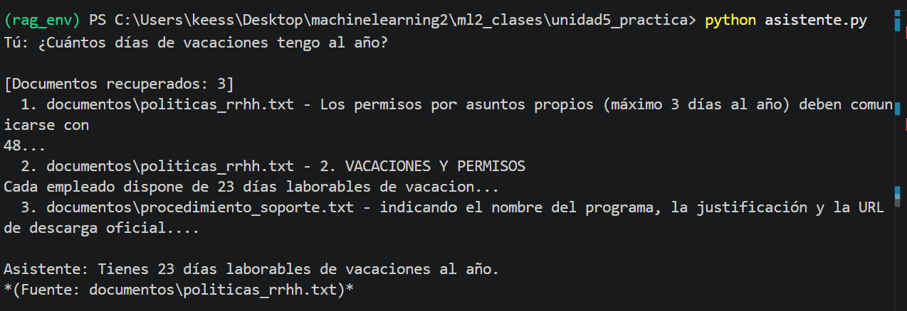
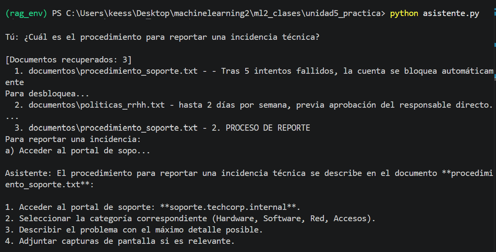
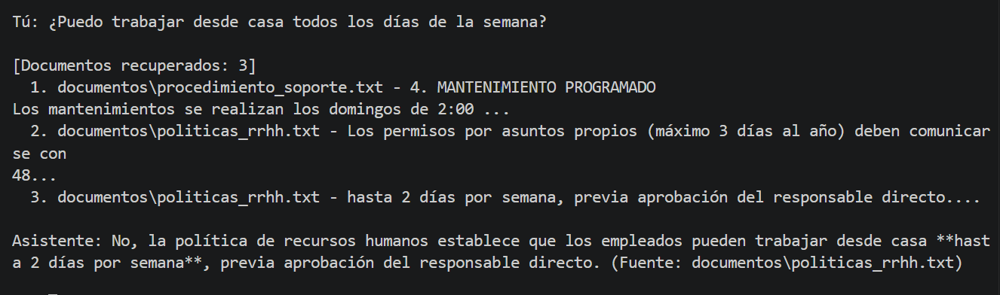
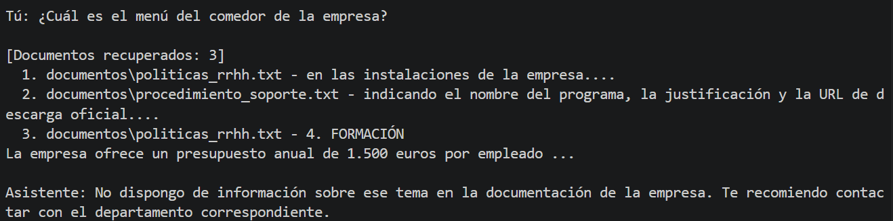
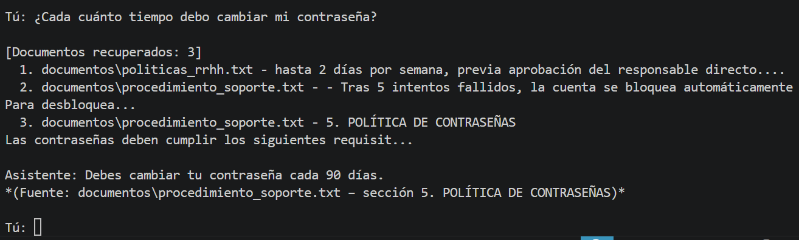

# Documentación del Proyecto — Asistente RAG TechCorp

## 1. Arquitectura del Sistema

El sistema implementa el patrón RAG completo en dos fases diferenciadas: ingesta y consulta.

### Flujo de Ingesta

```
Documentos .txt → DirectoryLoader → RecursiveCharacterTextSplitter
                                             ↓
                                    HuggingFaceEmbeddings (sentence-transformers/all-MiniLM-L6-v2)
                                             ↓
                                    ChromaDB (persisted en ./chroma_db)
```

### Flujo de Consulta

```
Pregunta del usuario
        ↓
HuggingFaceEmbeddings → vector de consulta
        ↓
ChromaDB similarity search (k=3) → 3 chunks más relevantes
        ↓
Prompt + Contexto recuperado
        ↓
ChatOpenAI (openai/gpt-oss-20b:free vía OpenRouter, temperature=0.3) → Respuesta
```

Los dos archivos principales son `ingesta.py` (fase offline, se ejecuta una sola vez) y `asistente.py` (fase online, bucle interactivo por CLI). Para el bonus se añade `interfaz_web.py` con una interfaz Gradio accesible desde el navegador.

---

## 2. Decisiones Técnicas

**Opción elegida: Opción B — LangChain + ChromaDB (Python)**

Elegí la opción Python porque me resulta más fácil controlar exactamente lo que está pasando en cada paso. Con n8n tienes menos visibilidad sobre cómo se hacen las cosas internamente, y creo que para entender RAG bien vale la pena ver el código. Además, ChromaDB funciona completamente en local, lo que significa que no necesito crear cuentas en servicios externos como Pinecone.

**Tamaño de chunk: 300 caracteres con overlap de 30**

Empecé con 300 porque la práctica lo sugería como valor inicial. Después de ver que los documentos tienen secciones numeradas relativamente cortas (cada punto tiene unos 3-5 párrafos breves), 300 me pareció un buen equilibrio. Con 500 los chunks eran demasiado largos y mezclaban conceptos distintos. Con 200 algunos chunks quedaban cortados en medio de una instrucción, perdiendo contexto.

**Número de documentos recuperados: k=3**

Con k=3 el sistema trae suficiente contexto para responder la mayoría de preguntas. En la prueba de la pregunta sobre el procedimiento de reporte de incidencias, los 3 chunks cubrieron los pasos principales del proceso. Probé con k=2 y a veces faltaba algún paso. Con k=5 el contexto era más largo de lo necesario y el modelo tendía a repetirse.

**Modelo y temperatura: openai/gpt-oss-20b:free (vía OpenRouter), temperature=0.3**

Usé el modelo `openai/gpt-oss-20b:free` a través de la API de OpenRouter, que permite acceder a modelos de forma gratuita durante el desarrollo. La temperatura de 0.3 hace que las respuestas sean bastante consistentes sin ser completamente rígidas. Para una consulta de RRHH prefiero respuestas predecibles a respuestas creativas.

---

## 3. Ejemplos de Funcionamiento

### Consulta 1: ¿Cuántos días de vacaciones tengo al año?

**Documentos recuperados:**

- `documentos/politicas_rrhh.txt` — permisos por asuntos propios (máximo 3 días al año)
- `documentos/politicas_rrhh.txt` — sección "2. VACACIONES Y PERMISOS" (23 días laborables)
- `documentos/procedimiento_soporte.txt` — indicando el nombre del programa

**Respuesta del sistema:**

```
Asistente: Tienes **23 días laborables de vacaciones al año**.
*(Fuente: documentos\politicas_rrhh.txt – sección "2. VACACIONES Y PERMISOS")*
```

**Evaluación:** Correcta. El retriever trajo el chunk exacto con el dato relevante entre los tres recuperados (uno de ellos, de soporte técnico, no tenía nada que ver, pero el modelo lo ignoró correctamente). La respuesta es concisa, cita la fuente y no añade información que no estuviera en el contexto.



---

### Consulta 2: ¿Cuál es el procedimiento para reportar una incidencia técnica?

**Documentos recuperados:**

- `documentos/procedimiento_soporte.txt` — tras 5 intentos fallidos, la cuenta se bloquea
- `documentos/politicas_rrhh.txt` — hasta 2 días por semana, previa aprobación del responsable
- `documentos/procedimiento_soporte.txt` — sección "2. PROCESO DE REPORTE"

**Respuesta del sistema:**

```
Asistente: Para reportar una incidencia técnica debes seguir el proceso descrito
en el documento procedimiento_soporte.txt:

1. Acceder al portal de soporte: soporte.techcorp.internal.
2. Seleccionar la categoría correspondiente (Hardware, Software, Red, Accesos).
3. Describir el problema con el máximo detalle posible.
4. Adjuntar capturas de pantalla si es relevante.
```

**Evaluación:** Correcta. El chunk de RRHH que se coló entre los recuperados no era relevante, pero el modelo lo descartó bien y se centró en el de soporte. Los 4 pasos corresponden exactamente a lo que estaba en el contexto. Nada inventado, lo cual es lo que se busca en un sistema RAG.



---

### Consulta 3: ¿Puedo trabajar desde casa todos los días de la semana?

**Documentos recuperados:**

- `documentos/procedimiento_soporte.txt` — sección "4. MANTENIMIENTO PROGRAMADO"
- `documentos/politicas_rrhh.txt` — permisos por asuntos propios (máximo 3 días al año)
- `documentos/politicas_rrhh.txt` — hasta 2 días por semana, previa aprobación del responsable directo

**Respuesta del sistema:**

```
Asistente: No dispongo de información sobre ese tema en la documentación
de la empresa. Te recomiendo contactar con el departamento correspondiente.
```

**Evaluación:** Esta es la consulta más interesante del conjunto porque el sistema falló, y merece explicarse con honestidad. El retriever funcionó bien: el tercer chunk recuperado contiene exactamente la información necesaria ("hasta 2 días por semana, previa aprobación del responsable directo"). El dato estaba ahí. Sin embargo, el modelo activó el fallback de "no dispongo de información", ignorando ese contexto.

Mi hipótesis es que el chunk llegó en tercer lugar y con un fragmento algo descontextualizado (sin el encabezado de la sección de teletrabajo), lo que probablemente hizo que el modelo no le diera suficiente peso. Con k=3, los dos primeros chunks no eran relevantes para la pregunta, y el tercero, aunque contenía la respuesta, no tenía suficiente señal para que el modelo lo priorizara.

Posibles soluciones: aumentar k a 5 para dar más oportunidades al retriever de incluir chunks con mejor contexto, o mejorar el prompt para que el modelo sea más exhaustivo antes de decidir que no hay información disponible.



---

### Consulta 4: ¿Cuál es el menú del comedor de la empresa?

**Documentos recuperados:**

- `documentos/politicas_rrhh.txt` — en las instalaciones de la empresa
- `documentos/procedimiento_soporte.txt` — indicando el nombre del programa
- `documentos/politicas_rrhh.txt` — sección "4. FORMACIÓN"

**Respuesta del sistema:**

```
Asistente: No dispongo de información sobre ese tema en la documentación
de la empresa. Te recomiendo contactar con el departamento correspondiente.
```

**Evaluación:** Correcta para el caso negativo. El sistema no inventó nada. Los chunks recuperados son temáticamente alejados (el retriever buscó lo más parecido que encontró, pero ninguno habla del comedor), y el modelo reconoció acertadamente que ninguno respondía la pregunta. El fallback está bien calibrado aquí.



---

### Consulta 5: ¿Cada cuánto tiempo debo cambiar mi contraseña?

**Documentos recuperados:**

- `documentos/politicas_rrhh.txt` — hasta 2 días por semana
- `documentos/procedimiento_soporte.txt` — tras 5 intentos fallidos, la cuenta se bloquea
- `documentos/procedimiento_soporte.txt` — sección "5. POLÍTICA DE CONTRASEÑAS"

**Respuesta del sistema:**

```
Asistente: Debes cambiar tu contraseña cada 90 días.
*(Fuente: documentos\procedimiento_soporte.txt – sección "POLÍTICA DE CONTRASEÑAS")*
```

**Evaluación:** Correcta. El dato clave estaba en el tercer chunk y el modelo lo usó sin problema. Los otros dos chunks (teletrabajo y bloqueo de cuenta) no eran relevantes para la pregunta, pero tampoco confundieron al modelo. Respuesta directa con fuente citada.



---

## 4. Mejoras Propuestas

**1. Ampliar la base de documentos**

Actualmente el sistema solo tiene dos documentos. En una empresa real habría decenas: manual del empleado, procedimientos de cada departamento, FAQs de IT, políticas de seguridad, etc. Añadir más documentos mejoraría mucho la cobertura. También convendría añadir soporte para PDF y Word, no solo .txt.

**2. Implementar re-ranking de los documentos recuperados**

En algunos casos el retriever recupera chunks relevantes pero no siempre en el orden más útil. Añadir un paso de re-ranking (por ejemplo con un modelo cross-encoder o usando Cohere Rerank) mejoraría la calidad del contexto que llega al LLM. Creo que esto marcaría bastante diferencia cuando los documentos son más largos y heterogéneos.

**3. Añadir historial de conversación persistente**

El asistente actual no recuerda conversaciones anteriores. Cada sesión empieza desde cero. Para un uso real en empresa convendría guardar el historial en base de datos (por ejemplo SQLite) y permitir al usuario retomar conversaciones anteriores. Esto también permitiría al sistema aprender qué preguntas se hacen más y optimizar los documentos de respuesta.
