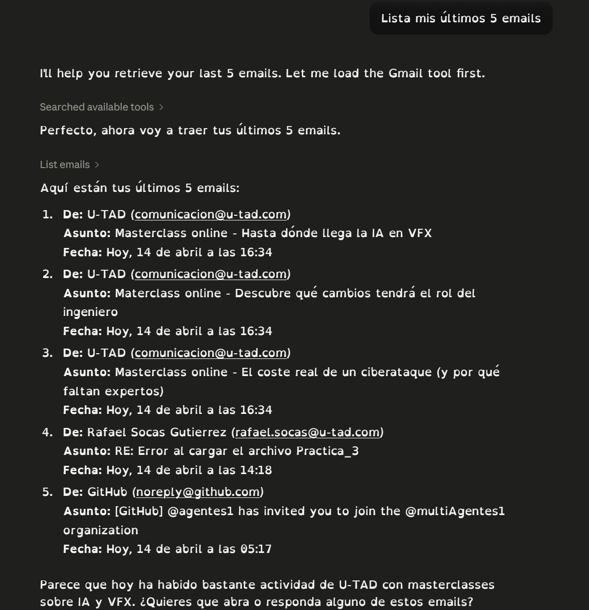
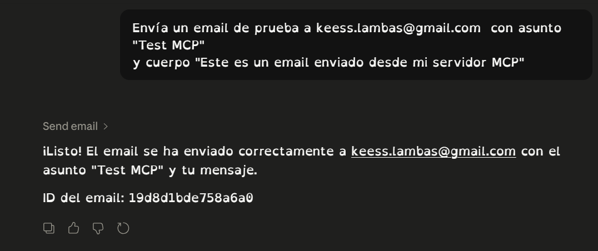
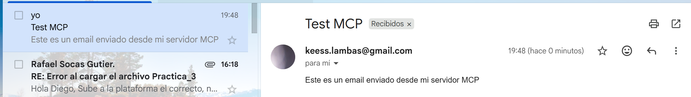
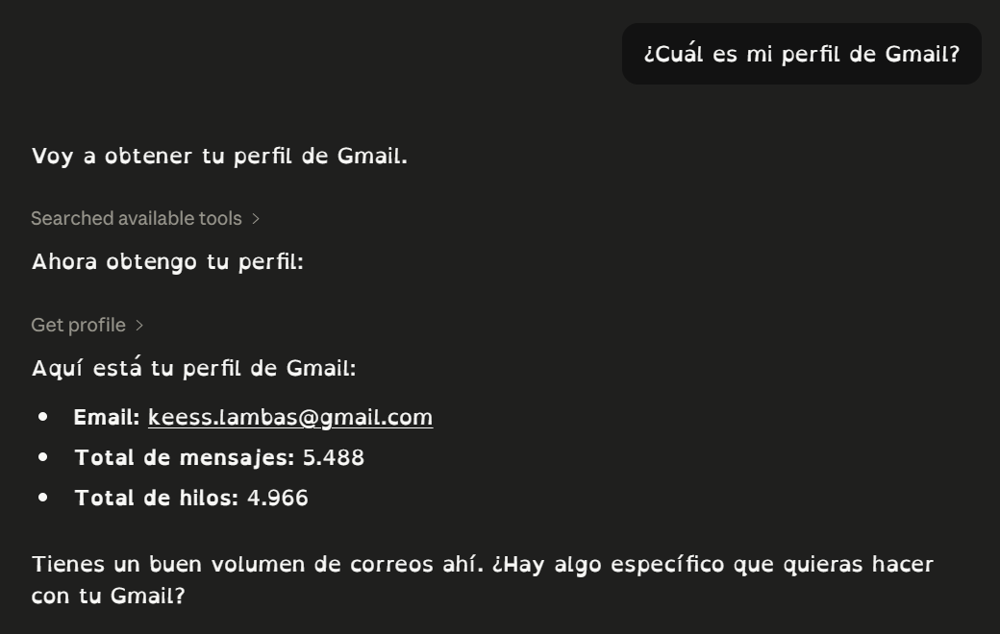
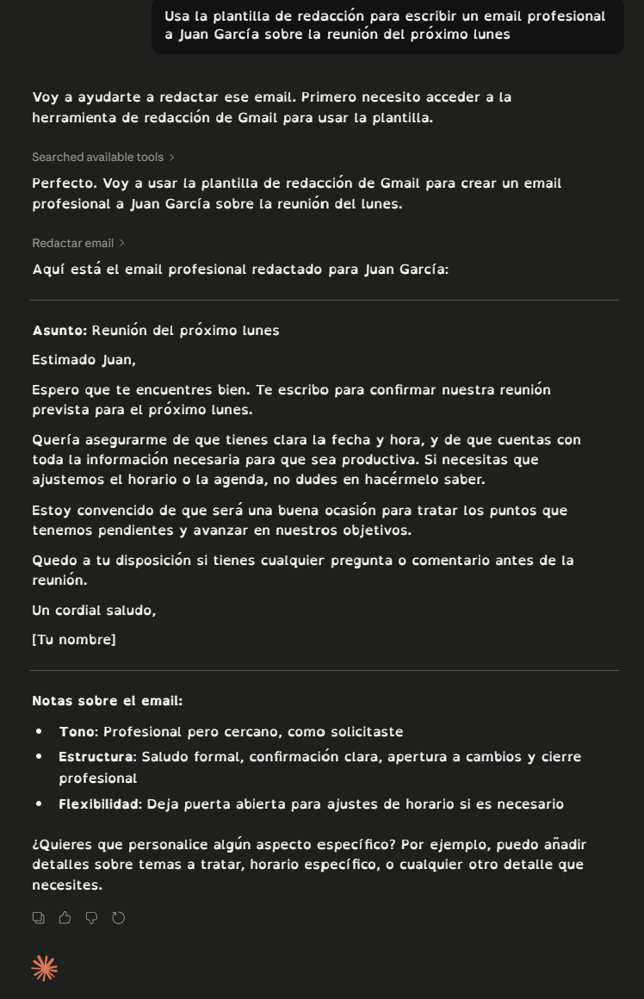

# Guía de Replicación — Gmail MCP Server

## Práctica Unidad 6 - Model Context Protocol

**Autor:** Diego Keess Lambás
**Fecha:** Abril 2026
**Tiempo estimado:** 45-60 minutos

---

## Requisitos Previos

- Python 3.10 o superior instalado
- `uv` instalado (gestor de paquetes Python)
- Cuenta de Google con Gmail
- Claude Desktop instalado

---

## Paso 1 — Crear el Proyecto en Google Cloud Console

1. Ve a [https://console.cloud.google.com/](https://console.cloud.google.com/)
2. Haz clic en el **selector de proyectos** (barra superior) → **"Nuevo Proyecto"**
3. Nombre del proyecto: `gmail-mcp-server` → **"Crear"**
4. Espera unos segundos y asegúrate de que el proyecto queda **seleccionado**

> Captura sugerida: Pantalla de Google Cloud con el proyecto creado y seleccionado

---

## Paso 2 — Configurar la Pantalla de Consentimiento OAuth

1. Menú hamburguesa → **"APIs y servicios" > "Pantalla de consentimiento OAuth"**
2. Tipo de usuario: **Externo** → **"Crear"**
3. Rellena el formulario:
   - Nombre de la aplicación: `Gmail MCP Server`
   - Correo de asistencia al usuario: tu email
   - Email de contacto del desarrollador: tu email
4. **"Guardar y continuar"**
5. Sección **Permisos** → **"Agregar o quitar permisos"**, añade los tres scopes:
   - `https://www.googleapis.com/auth/gmail.readonly`
   - `https://www.googleapis.com/auth/gmail.send`
   - `https://www.googleapis.com/auth/gmail.modify`
6. **"Actualizar"** → **"Guardar y continuar"**
7. Sección **Usuarios de prueba** → **"+ Agregar usuarios"** → añade tu email de Gmail
8. **"Agregar"** → **"Guardar y continuar"** → **"Volver al panel"**

> Captura sugerida: Pantalla de consentimiento con los 3 scopes añadidos

---

## Paso 3 — Crear las Credenciales OAuth

1. **"APIs y servicios" > "Credenciales"**
2. **"+ Crear credenciales"** → **"ID de cliente OAuth"**
3. Tipo de aplicación: **Aplicación de escritorio**
4. Nombre: `Gmail MCP Client`
5. **"Crear"** → en el diálogo, clic en **"Descargar JSON"**
6. Renombra el archivo descargado a `credentials.json`
7. Cópialo en la carpeta del proyecto:
   ```
   gmail-mcp-server/credentials.json
   ```

> ⚠️ **NUNCA** subas este archivo a GitHub

> Captura sugerida: Diálogo de credenciales creadas con el botón de descarga

---

## Paso 4 — Habilitar la Gmail API

1. **"APIs y servicios" > "Biblioteca"**
2. Busca `Gmail API`
3. Haz clic en el resultado → **"Habilitar"**

> Captura sugerida: Panel de Gmail API con estado "Habilitada"

---

## Paso 5 — Estructura del Proyecto

La estructura final del proyecto es:

```
gmail-mcp-server/
├── gmail_mcp_server.py    # Servidor MCP principal
├── auth.py                # Script para generar token.json (solo primera vez)
├── credentials.json       # Credenciales OAuth (NO subir a GitHub)
├── token.json             # Token de acceso (NO subir a GitHub, se genera solo)
├── requirements.txt       # Dependencias
├── pyproject.toml         # Configuración del proyecto
└── .gitignore             # Excluye credentials.json y token.json
```

---

## Paso 6 — Instalar Dependencias

Abre una terminal en la carpeta del proyecto y ejecuta:

```bash
uv pip install fastmcp google-auth-oauthlib google-api-python-client
```

---

## Paso 7 — Generar el Token OAuth

Ejecuta el script de autenticación **una sola vez**:

```bash
python auth.py
```

- Se abrirá el navegador automáticamente
- Inicia sesión con tu cuenta de Google
- Acepta los permisos solicitados
- El archivo `token.json` se genera automáticamente en la carpeta

> Captura sugerida: Ventana del navegador con la pantalla de autorización de Google

> **Nota:** En ejecuciones posteriores, el token se renueva automáticamente. Solo necesitas repetir este paso si eliminas `token.json`.

---

## Paso 8 — Configurar Claude Desktop

Abre (o crea) el archivo de configuración de Claude Desktop:

- **Windows:** `C:\Users\TU_USUARIO\AppData\Roaming\Claude\claude_desktop_config.json`
- **macOS:** `~/Library/Application Support/Claude/claude_desktop_config.json`

Añade la configuración del servidor MCP (respetando el contenido existente):

```json
{
  "mcpServers": {
    "gmail": {
      "command": "python",
      "args": [
        "C:\\ruta\\completa\\a\\gmail-mcp-server\\gmail_mcp_server.py"
      ]
    }
  }
}
```

> Sustituye la ruta por la ruta real en tu sistema.

Reinicia Claude Desktop completamente (cierra desde la bandeja del sistema).

> Captura sugerida: Icono de herramientas en Claude Desktop mostrando "Gmail MCP Server" con sus tools listadas

---

## Paso 9 — Pruebas en Claude Desktop

### Prueba 1 — Listar Emails

Escribe en Claude Desktop:

```
Lista mis últimos 5 emails
```

Resultado esperado: Claude utiliza la tool `list_emails` y muestra remitente, asunto y fecha de cada email.

> 📸 **Captura 1:** Respuesta de Claude con los emails listados
>
> 

---

### Prueba 2 — Enviar Email

Escribe en Claude Desktop:

```
Envía un email de prueba a TU_EMAIL con asunto "Test MCP" 
y cuerpo "Este es un email enviado desde mi servidor MCP"
```

Resultado esperado: Claude utiliza la tool `send_email` y confirma el envío con el ID del mensaje.

> 📸 **Captura 2:** Confirmación de envío con el ID del mensaje
>
> 
>
> 

---

### Prueba 3 — Consultar Perfil

Escribe en Claude Desktop:

```
¿Cuál es mi perfil de Gmail?
```

Resultado esperado: Claude accede al resource `gmail://profile` y muestra el email, total de mensajes y hilos.

> 📸 **Captura 3:** Respuesta con los datos del perfil de Gmail
>
> 

---

### Prueba 4 — Prompt de Redacción

Escribe en Claude Desktop:

```
Usa la plantilla de redacción para escribir un email profesional 
a Juan García sobre la reunión del próximo lunes
```

Resultado esperado: Claude utiliza el prompt `redactar_email` y genera un borrador completo con saludo, cuerpo y despedida.

> 📸 **Captura 4:** Borrador de email generado por Claude
>
> 

---

## Resumen de Componentes Implementados

| Componente         | Tipo                           | Descripción                          |
| ------------------ | ------------------------------ | ------------------------------------- |
| `list_emails`    | Tool                           | Lista emails de la bandeja de entrada |
| `send_email`     | Tool                           | Envía un email nuevo                 |
| `get_profile`    | Resource (`gmail://profile`) | Perfil del usuario autenticado        |
| `redactar_email` | Prompt                         | Plantilla de redacción de emails     |

---

## Archivos a Incluir en la Entrega

```
gmail-mcp-server/
├── gmail_mcp_server.py    ✅ Incluir
├── auth.py                ✅ Incluir
├── requirements.txt       ✅ Incluir
├── pyproject.toml         ✅ Incluir
├── .gitignore             ✅ Incluir
├── documentacion.md       ✅ Incluir
├── GUIA_REPLICACION.md    ✅ Incluir
├── capturas/              ✅ Incluir (screenshots de las 4 pruebas)
├── credentials.json       ❌ NO incluir (en .gitignore)
└── token.json             ❌ NO incluir (en .gitignore)
```
